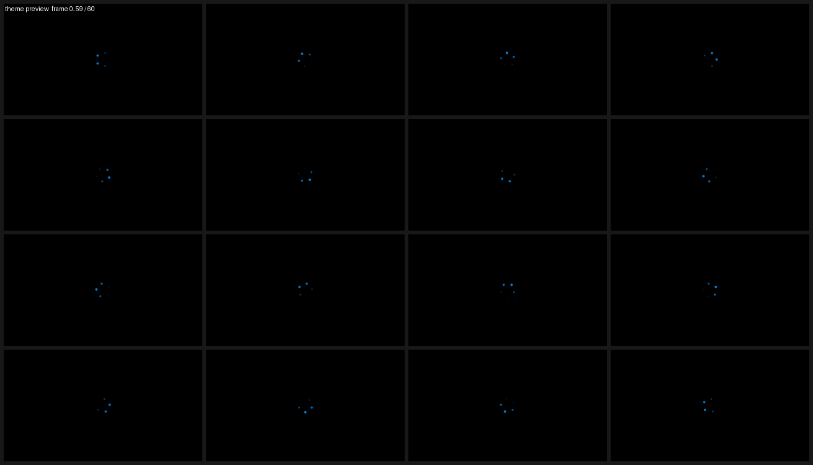

# BootAnim

**给 Windows 加一段真正的开机动画。** 一个放在 EFI 系统分区上的 UEFI 应用程序 ——
固件加载的是它，它先播你的图片序列，再把控制权交回 Windows 的引导程序。

对 Windows 来说什么都没发生，但用户看到的是你的开机动画。

[](LICENSE)
[](CHANGELOG.md)
[-lightgrey.svg)](#)
[](#11-可靠性设计与已验证范围)
[](CONTRIBUTING.md)

**其他语言：** [English summary](#english-summary) · 中文（完整文档）

---

> ## ⚠️ 动手之前请先读这一段
> 
> 这个程序会**替换 ESP 上的 `\EFI\Microsoft\Boot\bootmgfw.efi`** —— 系统启动链上的一环。
> 
> **一个 bug 有可能让机器开不了机。**
> 
> 请在动手前确认你**知道怎么进 Windows 恢复环境**，并且记住这条恢复命令：
> 
> ```
> ren S:\EFI\Microsoft\Boot\bootmgfw-orig.efi bootmgfw.efi
> ```
> 
> （`S:` 换成你的 ESP 盘符；也可以用 `diskpart` 的 `assign` 挂出来）
> 
> 程序做了多层防护（备份失败就中止、装完校验内嵌标记、配置出错只退化、
> 动画有超时上限、帧数据损坏不会越界写），但**没有任何软件能保证 100%**。
> 
> 详见 [SECURITY.md](SECURITY.md) 和 [docs/恢复与排错.md](docs/恢复与排错.md)。

---

```
 通电 → 固件 → [ BootAnim：播放 anim.baa / BMP 序列 ] → Windows Boot Manager → Windows
                  ↑ 任何按键可跳过，最多占用 TIMEOUT_MS 毫秒
```

## 它长什么样

| 动画预览                    | 图形管理工具               |
| ----------------------- | -------------------- |
|  |  |

（`dist/preview.png` 是内置示例动画的一帧；`dist/demo.gif` 是动态演示）

---

## 目录

- [1. 特性](#1-特性)
- [2. 目录结构](#2-目录结构)
- [3. 五分钟上手](#3-五分钟上手)
- [4. 图形界面管理工具（推荐日常使用）](#4-图形界面管理工具推荐日常使用)
- [5. 做自己的动画](#5-做自己的动画)
- [6. 配置参考](#6-配置参考)
- [7. 安装方式](#7-安装方式)
- [8. 卸载与灾难恢复](#8-卸载与灾难恢复)
- [9. 排错](#9-排错)
- [10. 代码结构](#10-代码结构)
- [11. 可靠性设计与已验证范围](#11-可靠性设计与已验证范围)
- [12. 发布到 GitHub](#12-发布到-github)
- [13. 许可证](#13-许可证)
- [English summary](#english-summary)

---

## English summary

**BootAnim is a UEFI application that plays a boot animation on Windows.**

Windows 10/11 does not let you customize the boot animation (`bootux` switches have
long been dead). This project solves it from the firmware side: the app replaces
`\EFI\Microsoft\Boot\bootmgfw.efi` on the EFI System Partition, plays your image
sequence (`.baa` container or a BMP frame sequence), then chainloads the original
boot manager. As far as Windows is concerned nothing happened.

**Highlights**

- Pure UEFI application — no OS drivers, no kernel patching, no Secure Boot bypass
- Any key skips the animation; a hard `TIMEOUT_MS` cap (default 15 s) guarantees
  the machine always reaches Windows
- `.baa` frame container with RLE — a 1920×1080 / 60-frame demo is ~4.7 MB
- **Zero-dependency GUI manager** (`gui/BootAnimGUI.exe`): swap images, enable/disable,
  install/uninstall. Built from PowerShell + WinForms + GDI+, no Python/.NET SDK needed
- Accepts **GIF / multi-frame TIFF** (split natively) and **MP4 / MOV / MKV / AVI**
  (via ffmpeg — Windows-side or inside WSL)
- Single-file graphical installer (`install/BootAnimSetup.exe`)
- **887 assertions** on the `.baa` reference implementation, plus GUI test suites

> ⚠️ **This tool modifies your boot path. A bug could make the machine unbootable.**
> Read [SECURITY.md](SECURITY.md) first and make sure you know the one-line recovery
> command: `ren S:\EFI\Microsoft\Boot\bootmgfw-orig.efi bootmgfw.efi`

**Licensing:** GPL-3.0-or-later — see [LICENSE](LICENSE).
You may use, modify and redistribute it freely; if you **distribute binaries**
you must also make the corresponding source available (GPL §6).
It does **not** bundle FFmpeg; the usual Windows builds of FFmpeg are GPL v3,
which is the same licence family — see [THIRD_PARTY_NOTICES.md](THIRD_PARTY_NOTICES.md).

**Documentation is in Chinese.** Contributions of English docs are very welcome —
see [CONTRIBUTING.md](CONTRIBUTING.md).

---

## 1. 特性

| 能力         | 说明                                                                                       |
| ---------- | ---------------------------------------------------------------------------------------- |
| 真·开机动画     | 在 Windows 引导程序之前播放，是真正的"开机画面"，不是登录后的屏保                                                   |
| 帧序列播放      | 支持 `.baa` 打包格式（推荐）和 BMP 帧序列（`frame0000.bmp`…）                                            |
| 自适应缩放      | `native` / `fit` / `fill` / `stretch`；`nearest` 与 `bilinear` 两种滤波                        |
| 全 GOP 像素格式 | BGR8 / RGB8 / 16·24·32bpp BitMask / BltOnly 都能正确输出                                       |
| 零素材也能用     | 一个帧文件都没有时，自动播放内置的"转圈"动画，绝不黑屏                                                             |
| 绝不卡开机      | `LOOP` × `TIMEOUT_MS` 双重限制 + 真实时间兜底 + 关闭看门狗                                              |
| 可跳过        | 起播 400ms 后任意按键立即结束动画                                                                     |
| 安全回滚       | 安装脚本自动备份原引导程序，卸载脚本原样还原；配置/程序全坏也能开机                                                       |
| 抗损坏        | 帧文件被截断/翻位只会跳过该帧，不会崩、不会死循环、不会越界写                                                          |
| **图形界面**   | `gui\BootAnimGUI.cmd` —— 选图片、生成动画、启用/禁用、装/卸接管，全在一个窗口里完成，**不需要装 Python / .NET SDK / 编译器** |

---

## 2. 目录结构

```
esp-boot-anim/
├─ src/                        UEFI 应用程序源码（C，无 C 运行时依赖）
│  ├─ BootAnim.c               入口：读配置 → 初始化图形 → 播放 → 交回控制权
│  ├─ Ba.h  BaPlat.h           公共接口（Ba.h 完全不依赖 UEFI，可单独做单元测试）
│  ├─ BaUtil.c                 内存 / 字符串 / UTF-8→UTF-16
│  ├─ BaConfig.c               bootanim.cfg 解析
│  ├─ BaImage.c                BMP 解码 + .baa 解码(RLE) + 缩放采样
│  ├─ BaGfx.c                  GOP 模式选择、像素格式转换、呈现
│  ├─ BaAnim.c                 流式播放器（.baa / BMP 序列）
│  ├─ BaFallback.c             内置兜底动画（纯函数渲染 + 上屏）
│  ├─ BaGuids.c/.h             自带的 GUID 定义（EDK2/gnu-efi 通用）
│  ├─ BaPlatUefi.c             UEFI 平台层 + 链式引导（含自链保护）
│  └─ BaUefi.h                 EDK2 / gnu-efi 头文件兼容层
├─ build/
│  ├─ edk2/                    EDK2 包（推荐路径）：.inf .dec .dsc + build-edk2.bat/.sh
│  └─ gnuefi/Makefile          gnu-efi 轻量路径（备选）
├─ tools/                      PC 端工具（Python + C 自测）
│  ├─ baanim.py                .baa 格式的参考实现（编码+解码）+ CLI
│  ├─ selftest.py              格式自检：往返 / 损坏模糊测试（887 项断言）
│  ├─ make_demo.py             程序化生成演示动画（不需要任何素材）
│  ├─ pack_anim.py             图片序列 → .baa
│  ├─ check_c.py               C 源码结构一致性检查（没有编译器时的静态自检）
│  ├─ check-textfiles.ps1      检查各类文本文件的编码/行尾（踩过坑，固化成检查）
│  ├─ test-gui-packer.ps1      GUI 打包内核端到端测试（C# -> .baa -> Python 比对）
│  ├─ test-gui-cfg.ps1         GUI 数据逻辑单测（开关 / 读 .baa 头 / 自然排序）
│  ├─ test-gui-build.ps1       不显示窗口构造整个窗体，抓枚举/属性赋值错误
│  ├─ test-gui-video.ps1       视频拆帧接线（用桩 ffmpeg 验证参数拼装）
│  ├─ test-gui-mp4real.ps1     真实 ffmpeg + 真实视频的端到端测试
│  ├─ fix-textfiles.ps1        上面那个检查脚本的"自动修复"版
│  ├─ find-python.ps1          找可用的 Python 3（测试共用，不写死路径）
│  ├─ set-repo-url.ps1         把 OWNER/REPO 占位符换成你的仓库地址
│  ├─ _testdata/               selftest.py 生成的比对数据（给下面的 C 自测用）
│  └─ hosttest/                PC 端自测程序（C）：用本机编译器跑一遍 C 逻辑
│     ├─ main.c                7 组测试，与 Python 参考输出逐字节比对
│     ├─ BaPlatHost.c          BaPlat.h 的 PC 实现（文件用 stdio，内存用 malloc）
│     └─ Makefile
├─ gui/                        图形界面管理工具（零依赖，不需要 Python/.NET SDK）
│  ├─ BootAnimGUI.exe          ★ 双击即用：单文件，无黑窗口，自动提权
│  ├─ BootAnimGUI.cmd          不用 exe 时的启动器（自动提权）
│  ├─ BootAnimGUI.ps1          主界面（exe 里内嵌的就是它）
│  ├─ BootAnimPacker.ps1       图片打包内核（运行期编译的 C#）
│  ├─ BootAnimLauncher.cs      把上面几个包成 exe 的启动器
│  ├─ BootAnimGUI.ico          图标
│  ├─ BootAnimGUI.manifest     清单（仅参考，刻意没有嵌进 exe）
│  └─ build-gui-exe.ps1        重新打包 exe（用系统自带的 csc.exe）
├─ install/
│  ├─ Install-BootAnim.ps1     一键安装（自动定位/挂载 ESP、备份、校验）
│  ├─ Uninstall-BootAnim.ps1   一键卸载/还原
│  ├─ EspTools.ps1             公共函数
│  └─ bootanim.cfg             配置模板（安装时会复制到 ESP）
├─ dist/                       构建产物与演示动画
│  ├─ anim.baa                 1920×1080 / 60 帧 / 30fps 演示动画（4.7 MiB）
│  ├─ small.baa                640×360 版本（557 KiB），用来快速试
│  ├─ preview.png              演示动画的拼图预览
│  └─ demo.gif                 动图预览
└─ docs/恢复与排错.md           起不来的时候看这个
```

---

## 3. 五分钟上手

### 3.0 先看看动画长什么样

`dist/preview.png` 是演示动画的拼图预览；`dist/demo.gif` 是动图。


### 3.1 PC 端自测（强烈建议先做这一步）

装到 ESP 之前，先用本机编译器把 C 逻辑跑一遍 —— 不需要 EDK2，也不需要真机：

```bash
cd tools/hosttest
python ../selftest.py      # 先生成比对数据到 ../_testdata
make                       # 或者用 Makefile 注释里的手动编译命令
./hosttest
```

它会做 7 组测试，其中最关键的是把 **C 的解码结果与 `tools/baanim.py`
（Python 参考实现）的输出逐字节比对**：

```
[1] .baa 解码与 Python 参考输出逐字节比对     <- 20 帧 RLE + 20 帧未压缩
[2] RLE 边界与损坏检测                        <- 截断/溢出/非法长度必须报错
[3] BMP 解码与 Pillow 的 BGRX 输出逐字节比对  <- 24/32/8位调色板/1位
[4] bootanim.cfg 解析                         <- 含各种畸形配置
[5] 目标矩形与缩放采样                        <- native/fit/fill/stretch + 角点
[6] 内置兜底动画渲染                          <- 背景色、圆点、帧间差异
[7] 端到端：BaAnimPlay 播放整个 .baa          <- 帧数、清屏次数、末帧内容
```

### 3.2 编译出 `bootanim.efi`

需要 **EDK2**（Windows 上用 VS2022 的 C++ 工具链；Linux/WSL 上用 GCC5）。
本仓库不附带已编译的 `.efi`，请在本机编译（见 [第 10 节](#10-可靠性设计与已验证范围) 的说明）。

```bat
:: 管理员/普通 cmd 均可，把 C:\edk2 换成你的 EDK2 路径
cd esp-boot-anim\build\edk2
build-edk2.bat C:\edk2
```

Linux / WSL / MSYS2：

```bash
cd esp-boot-anim/build/edk2
chmod +x build-edk2.sh && ./build-edk2.sh ~/src/edk2 GCC5 RELEASE X64
```

成功后会得到 `dist\bootanim.efi`。

> 没有 EDK2？也可以试 `build/gnuefi/Makefile`（需要 `gnu-efi` 开发包），
> 但那条路径没有在开发机上验证过，出问题请优先回到 EDK2。

### 3.3 装到 ESP

用**管理员** PowerShell：

```powershell
cd esp-boot-anim\install
.\Install-BootAnim.ps1 -DryRun     # 先看看它打算做什么
.\Install-BootAnim.ps1             # 真正安装
```

脚本会自动：定位 ESP → 复制 `\EFI\BootAnim\{bootanim.efi,anim.baa,bootanim.cfg}`
→ 把 `\EFI\Microsoft\Boot\bootmgfw.efi` 备份成 `bootmgfw-orig.efi`
→ 把我们的程序放成 `bootmgfw.efi`。

重启，就能看到动画了。**任何按键都能跳过。**

### 3.4 卸载

```powershell
cd esp-boot-anim\install
.\Uninstall-BootAnim.ps1
```

---

## 4. 图形界面管理工具（推荐日常使用）

双击 **`gui\BootAnimGUI.exe`** 就行 —— 单个文件、没有黑窗口、自动弹 UAC 提权。

它内部把 4 个 PowerShell 脚本作为**内嵌资源**带着，运行时解到临时目录再驱动
PowerShell。所以它**不依赖** `install\`、`gui\` 里的任何 `.ps1`；只额外需要
`dist\bootanim.efi`（用于「安装接管」，找不到也不影响换图片和开关）。

> 需要**先编译** `dist\bootanim.efi` 才能用「安装接管」；
> 只想换图片 / 开关动画的话，不需要 .efi。
> 
> exe 里内嵌的是打包时的脚本副本 —— **改了 `.ps1` 要重跑
> `gui\build-gui-exe.ps1` 才会反映到 exe 里**。
> 不想用 exe 的话，`gui\BootAnimGUI.cmd` + `.ps1` 也一直可用（方便自己改）。

自检（不弹界面，验证打包是否正常）：

```powershell
gui\BootAnimGUI.exe --selfcheck
```

会打印内嵌资源清单、路径改写结果、改写后脚本的语法检查，并写一份报告到
`%TEMP%\BootAnimGUI_selfcheck.txt`。

```
┌─ BootAnim 开机动画管理工具 ─────────────────────────────────────┐
│ 状态    ESP: E:\   引导接管: 已接管开机   动画: 启用中            │
│         当前动画: 1920x1080  60 帧  30fps  4,813 KB  RLE          │
│         原版引导备份: 正常（bootmgfw-orig.efi）                   │
├─ 动画开关（不用卸载，改一行配置即可）───────────────────────────┤
│  (•) 启用（开机播放动画）   ( ) 禁用（直接进 Windows）    [应用]  │
├─ 帧图片（选好图片 -> 生成动画 -> 写进 ESP）──────────────────────┤
│  [添加图片…] [添加文件夹…] [上移] [下移] [移除选中] [清空]       │
│  ┌ 文件列表 ──────────┐  ┌ 预览 ──────────────┐                 │
│  │ frame0000.png      │  │                    │                 │
│  │ frame0001.png      │  │    （第一帧）      │                 │
│  └────────────────────┘  └────────────────────┘                 │
│  分辨率 [1920]x[1080] [用屏幕分辨率]  帧率[30]                   │
│  适配 [contain▾]  背景[#000000]  [x] RLE 压缩                   │
│  [=========进度=========]      [生成动画并写入 ESP]              │
├─ Windows 引导接管 ──────────────────────────────────────────────┤
│  [安装接管] [卸载（还原原版引导）] [打开 ESP 动画目录] [刷新状态]│
├─ 日志 ──────────────────────────────────────────────────────────┤
│  11:20:31 [信息] ESP = E:\                                       │
│  11:20:31 [ OK ] 找到 dist\bootanim.efi                          │
└─────────────────────────────────────────────────────────────────┘
```

### 它能做什么

| 功能            | 说明                                                                                     |
| ------------- | -------------------------------------------------------------------------------------- |
| **启用 / 禁用**   | 改 ESP 上 `bootanim.cfg` 的 `ENABLED` 键。**不用卸载**，改回 1 立刻恢复，开机速度和没装一样                      |
| **换图片**       | 选图片（文件多选或整个文件夹）→ 设分辨率/帧率/适配/背景 → 生成 `.baa` → 写进 ESP → 自动把 `ENABLED` 设回 1               |
| **一键示例动画**    | 没有任何素材也能先用起来，程序化生成一段转圈动画                                                               |
| **安装 / 卸载接管** | 备份并替换 `bootmgfw.efi`，或原样还原。操作前有确认框                                                     |
| **预览与状态**     | 预览第一帧；显示当前动画的分辨率/帧数/帧率/体积、原版引导备份是否完好                                                   |
| **GIF 拆帧**    | 直接选一个 GIF / 多帧 TIFF，自动拆成每一帧，并读出原始帧率建议给你。**零依赖**                                        |
| **视频拆帧**      | MP4 / MOV / MKV / AVI / WMV / WEBM 直接选，自动按目标帧率拆帧。走 ffmpeg（放在 `gui\` 或 PATH，或 WSL 里装一个） |
| **实时预估**      | 加图片时同步显示「N 张 → 多少秒 → 未压缩多大」，超过 15 秒会警告                                                 |
| 列表操作          | 添加/移除/上移/下移/清空，文件按**自然顺序**排序（`frame2` 排在 `frame10` 前面）                                 |
| 日志            | 每一步都有时间戳记录；出错弹框并在日志里留痕                                                                 |

### 为什么它不需要装任何东西

| 需要的能力         | 用的什么                                                       |
| ------------- | ---------------------------------------------------------- |
| 图形界面          | PowerShell 5.1 自带的 `System.Windows.Forms`                  |
| 图片解码 / 缩放     | .NET Framework 自带的 GDI+（`System.Drawing`），LANCZOS 级的高质量双三次 |
| 打包 / RLE 编码   | `Add-Type` 在内存里调用 Windows 自带的 C# 编译器（`csc.exe`）编出原生代码      |
| ESP 挂载 / 引导备份 | 复用 `install\EspTools.ps1`                                  |

所以 **不需要 Python、不需要 .NET SDK、不需要任何编译器**。
第一次点「生成并写入 ESP」时会花 1~2 秒编译打包内核，之后就一直复用了。

> ⚠️ 请用 **Windows PowerShell 5.1**（`gui\BootAnimGUI.cmd` 里已经写死了
> `%SystemRoot%\System32\WindowsPowerShell\v1.0\powershell.exe`）。
> PowerShell 7 上 `System.Drawing` 的可用性因版本而异，不保证能用。

### 打包成单个 exe

```powershell
powershell -ExecutionPolicy Bypass -File gui\build-gui-exe.ps1
```

产物 `gui\BootAnimGUI.exe`（约 88 KB）。**不需要 .NET SDK / Visual Studio / 联网**，
用的是 Windows 自带的 `C:\Windows\Microsoft.NET\Framework64\v4.0.30319\csc.exe`。

打包脚本最后会自动跑一次 `--selfcheck`，你应该看到：

```
  [OK] 4 个资源已解包，脚本改写成功
       driver 长度 = 38532 字符
  [OK] 已写入: $GuiDir     = '...\BootAnimGUI_1.1.0'
  [OK] 已写入: $ProjRoot   = '...\esp-boot-anim'
  [OK] 已写入: $InstallDir = '...\BootAnimGUI_1.1.0'
  [OK] 自提权块已移除
  语法检查: SYNTAXOK
  [OK] 找到 bootanim.efi: ...\dist\bootanim.efi

自检结果: OK
```

几个设计决定，都是踩坑后改的：

| 决定                                                       | 原因                                                                                            |
| -------------------------------------------------------- | --------------------------------------------------------------------------------------------- |
| exe **不嵌应用程序清单**                                         | 某些环境下内嵌清单会报 `side-by-side configuration is incorrect`。改用运行时的 `SetProcessDPIAware()` 拿高 DPI 感知 |
| 提权**用代码** `runas` 重启自己，而不是清单里的 `requireAdministrator`    | 这样 `--selfcheck` 能在普通权限下跑，提权失败时也能给出明确提示                                                       |
| 用**隐藏的子进程** `powershell.exe` 跑脚本，而不是在进程内托管 PowerShell 引擎 | 不用引用 GAC 里的 `System.Management.Automation.dll`（跨版本差异大），而且 PowerShell 的报错能原样暴露出来               |
| 自检**每写一行就落一次盘**                                          | 万一中间某步炸了，看报告就知道卡在哪                                                                            |
| csc 加 `/codepage:65001`                                  | 源码注释和提示都是中文，显式指定 UTF-8                                                                        |

### 想要 10 秒（或更长）的动画？

**能做，而且不改代码。** 「多长」= 帧数 ÷ 帧率，10 秒 @30fps 就是 300 帧。
但你得先知道这三件事：

**① 程序允许 100000 帧，真正卡你的是 `TIMEOUT_MS`**

它默认 15 秒，播放器无论帧数多少都会在这个时间内退出（防呆：配置写错绝不能
导致开不了机）。所以：

| 想要      | 怎么配                                                   |
| ------- | ----------------------------------------------------- |
| 10 秒    | `LOOP=1` + 300 帧 @30fps —— **默认配置就够了**                |
| 30 秒    | `TIMEOUT_MS=30000`                                    |
| 不限时长    | `TIMEOUT_MS=0` + `LOOP=1`（会完整播完所有帧）                   |
| 素材短、播得久 | `LOOP=0` + `TIMEOUT_MS=20000` ← **最省事**，3 秒素材循环播 20 秒 |

**② 300 张图的体积取决于画面内容，差别能有 100 倍**

| 画面            | 压缩比     | 1080p 单帧  | 300 帧总计   |
| ------------- | ------- | --------- | --------- |
| 纯色 / 扁平图标     | ~1%     | 80 KB     | ~24 MB ✓  |
| 扁平 UI 截图      | 1~5%    | 80~400 KB | 24~120 MB |
| 照片 / 视频帧 / 渐变 | 50~100% | 4~8 MB    | **放不下**   |

所以长动画请配 **1280×720 或 960×540** —— 体积随分辨率**平方**下降。
另外整个 `.baa` 超过 **32 MB** 就不再进内存了（改成逐帧读 FAT，会变慢），
长动画尽量压在 32 MB 以内。

**③ 素材不用自己一张张导 —— 直接丢视频或 GIF 进来**

* **视频（MP4/MOV/MKV/AVI/WMV/WEBM）**：需要 ffmpeg。放到 `gui\ffmpeg.exe`，
  或者装进 WSL（`wsl -e sudo apt install -y ffmpeg`），程序会自动发现。
  会按你设的帧率自动抽帧，不用自己导出图片序列。
* **GIF**：完全零依赖，程序用系统自带能力拆帧。

GUI 现在支持 **GIF / 多帧 TIFF 自动拆帧**：选一个动图，程序会把每一帧拆出来
（拆帧结果与 Pillow 逐像素一致，见下面的验证表），而且会读出 GIF 的原始帧间隔，
问你"要不要把帧率设成 25 fps"。

所以做 10 秒动画的正常流程是：

1. 做一个 1080p 或 720p、10 秒的动画，导出成 GIF（或视频 → GIF）
2. GUI 里「添加文件夹…」或「添加图片…」选那个 GIF → 自动变成 300 张帧
3. 帧率按提示确认（跟随 GIF 原速）
4. 看预估那一行：`300 张 -> 30 fps 下约 10.0 秒 · 未压缩 2373 MiB · ...`
5. 生成并写入 ESP
6. 需要超过 15 秒的话，改 ESP 上 `bootanim.cfg` 的 `TIMEOUT_MS`

> ⚠️ GIF 只有 256 色。如果你的动画有明显渐变，转成 GIF 会出现色带。
> 这种情况建议直接导出 PNG 序列，或用 960×540 降低色带可见度。

GUI 底部会实时显示预估，一眼就能看出够不够长、会不会太大：

```
300 张  ->  30 fps 下约 10.0 秒  ·  未压缩 2373 MiB  ·  按上次实测压缩到 1.0%，约 24.3 MiB
```

超过 15 秒时会追加一句警告提醒你改 `TIMEOUT_MS`。

### 视频（MP4 等）支持说明

| 格式                                 | 需要什么           | 验证情况                                     |
| ---------------------------------- | -------------- | ---------------------------------------- |
| GIF / 多帧 TIFF                      | **什么都不用装**     | 拆帧结果与 Pillow **逐像素一致**（`diffs=0/24`），已实测 |
| MP4 / MOV / MKV / AVI / WMV / WEBM | **ffmpeg.exe** | 命令行拼装、帧收集、上限、顺序、路径转换均已单测；真实解码未在本机验证      |

**ffmpeg 放哪儿都行**，程序按这个顺序找：

1. `gui\ffmpeg.exe`、`gui\ffmpeg\bin\ffmpeg.exe`
2. 项目根目录的 `ffmpeg.exe`、`bin\ffmpeg.exe`、`ffmpeg\bin\ffmpeg.exe`
3. `tools\ffmpeg.exe`
4. **浅层递归搜索**（项目根和 `gui\` 下 4 层以内）—— 直接把官网下载的压缩包
   解压丢进项目里就行，`ffmpeg-9.0.2-essentials_build\bin\ffmpeg.exe`
   这种结构能被自动找到
5. `PATH` 里的 `ffmpeg.exe`
6. WSL 里的 `ffmpeg`（`wsl.exe -e ffmpeg`，路径自动转 `/mnt/c/...`）

> 只有"找到"的结果会被缓存，"没找到"不缓存 —— 所以你中途把 ffmpeg 丢进来
> **不需要重启程序**，直接再点一次「添加图片」就行。

下载：<https://www.gyan.dev/ffmpeg/builds/> → `ffmpeg-release-essentials.zip` →
解压后从 `bin\` 里把 `ffmpeg.exe` 拿出来放到 `gui\` 即可。**不需要重启程序。**

程序给 ffmpeg 的参数是（`-vf` 里那条是等比缩放到不超过目标分辨率，剩下的留白/裁剪
交给打包器按你选的「适配」方式处理）：

```
ffmpeg -hide_banner -loglevel error -nostdin -i <视频>
       -an -sn
       -vf fps=30,scale=w=1920:h=1080:force_original_aspect_ratio=decrease
       -frames:v 1200 -y <临时目录>\v%05d.png
```

拆帧时会在界面上显示进度，最多取 **1200 帧**（防止手滑选了个两小时的电影）。

#### 为什么不用 Windows 自带的解码器？

我试过。结论是**在 PowerShell 里走不通**，实测依据：

- 按时间取帧的 API 是 `MediaComposition.GetThumbnailAsync(TimeSpan, Int32, Int32, VideoFramePrecision)`
  —— 它在 **`MediaComposition`** 上，`MediaClip` **没有**这个方法（用反射核对过成员列表）。
- 要用它必须先把 `MediaClip` 塞进 `MediaComposition.Clips`，而那是个 WinRT 的
  `IVector<MediaClip>`。PowerShell 5.1 只能拿到裸 `__ComObject`，
  `.Add()` 和 `.Append()` 都报 `does not contain a method named 'Add'`。
- 换用 C# 走 Media Foundation（`IMFSourceReader`）需要手写 200+ 行 COM 接口声明，
  而 `csc.exe` 又无法引用 `.winmd` 元数据。

所以 Windows 侧那条路放弃了。你本来就有 WSL，用 WSL 里的 ffmpeg 是最省事的。

#### 真实视频的 10 秒到底要多大（实测数据）

拿一段真实的 4K 屏保视频（8.78 秒 · 3840×2160 · h264 · 60fps）实测：
拆帧、打包成 `.baa` 后，**RLE 压缩比是 9.9%**（不是纯色图形那种 1%）。

所以真实视频内容下，1280×720 单帧约 **356 KB**：

| 分辨率      | 帧率  | 8.78 秒的帧数 | 预计体积         | 能不能进 32 MiB 内存缓存 |
| -------- | --- | --------- | ------------ | ---------------- |
| 1280×720 | 30  | 263       | **91.3 MiB** | ✗ 很可能放不下 EFI 分区  |
| 1280×720 | 15  | 132       | 45.8 MiB     | ✗ 放得下但会慢         |
| 960×540  | 30  | 263       | 51.4 MiB     | ✗                |
| 960×540  | 15  | 132       | **25.8 MiB** | ✓                |
| 640×360  | 30  | 263       | **22.8 MiB** | ✓                |
| 640×360  | 15  | 132       | 11.5 MiB     | ✓                |

**想要 10 秒又想保持 720p 画质？用循环。** 取前几秒 + `LOOP=0`：

| 取前几秒 | 帧数（30fps） | 体积 @1280×720 | 配置                            |
| ---- | --------- | ------------ | ----------------------------- |
| 2 秒  | 60        | 20.8 MiB     | `LOOP=0` + `TIMEOUT_MS=10000` |
| 3 秒  | 90        | **31.3 MiB** | 同上 ← 甜点区                      |
| 4 秒  | 120       | 41.7 MiB     | 同上                            |

这样能用 31 MiB 换来 10 秒的 720p 播放，而且刚好卡在 32 MiB 内存缓存线内。

> 先看一下你的 EFI 分区还剩多少空间：点界面里的「打开 ESP 动画目录」，
> 在资源管理器里看那个盘的剩余容量。Windows 默认只给 ESP 100 MB。
> 
> 界面底部会实时显示预估体积，超过 32 MiB 会警告，超过 90 MiB 会提示
> 你降分辨率或改用循环。

#### GIF 转出来的画面有色带？

GIF 只有 256 色。有明显渐变的动画转 GIF 会出现色带 —— 这种情况用 ffmpeg 直接从
原视频抽帧（PNG 序列是无损的），别走 GIF。

### 用图片做动画的几点建议

- **把图片先导出成屏幕的原生分辨率**（比如 1920×1080），这样 GUI 会走 1:1 直通，
  既不重采样也不失真，速度也最快。
- 图片尺寸和设定分辨率不一致时，用「适配」选择处理方式：
  `contain` 完整显示留背景边 / `cover` 裁剪填满 / `stretch` 拉伸 /
  `none` 直接报错（要求必须一致）。
- 帧率 30 就够顺；帧数 × (1/帧率) 就是动画时长，建议总长控制在 2~3 秒以内。
- 「RLE 压缩」对开机动画这种大面积纯色的画面效果极好（实测 1080p/60 帧压到
  原始数据的 1%，约 5 MB），**建议保持勾选**。
- 图片请用**不透明**的（PNG 带透明通道时，透明区域的 RGB 是未定义值）。

---

## 5. 做自己的动画

### 5.1 方式 A：图片序列 → `.baa`（推荐）

准备一串图片（PNG/JPG/BMP/WebP 都行，文件名里带序号，如 `f0001.png`）：

```bash
python tools/pack_anim.py 我的帧目录 --out dist\myanim.baa --width 1920 --height 1080 --fps 30
```

- `--fit contain|cover|stretch|none`：尺寸和 `--width/--height` 不一致时怎么处理
- `--bg RRGGBB`：`contain` 留边时用什么颜色填
- `--no-rle`：不压缩（体积大但解码最快）

**分辨率建议直接导出成屏幕的原生分辨率**（比如 1920×1080），这样 `SCALE=native`
走的是整行 memcpy 的快路径，画质最好、速度最快。

`.baa` 是 RLE 压缩的：像开机动画这种大面积纯色的画面，1920×1080×60 帧
只占 4.7 MiB（原始数据的 0.99%）。

### 5.2 方式 B：直接用 BMP 序列

把 BMP 放进 `\EFI\BootAnim\frames\`，命名 `frame0000.bmp`、`frame0001.bmp`…
然后在配置里写：

```ini
ANIM=frames\frame0000.bmp
FRAMES=0        ; 0 = 自动探测到第一个缺失的帧
```

BMP 必须是 **未压缩**（`BI_RGB` 或 `BI_BITFIELDS`）；支持 1/4/8/16/24/32 位、
自下而上或自上而下、带调色板。不支持 RLE 压缩的 BMP。

### 5.3 方式 C：先看演示动画

```bash
python tools/make_demo.py --width 1920 --height 1080 --frames 60 --fps 30
```

不依赖任何素材，程序化生成一个 Windows 11 风格的转圈动画
（`--theme dots|bar`），并做逐像素回读校验。
`dist/anim.baa` 就是用这个命令生成的。

> `dist/bootanim.cfg` 是 make_demo 顺手生成的示例，里面的
> `SKIP_KEY=ESC`、`VIDEO_MODE=native` 这类写法程序都能识别（分别等价于
> "任意键跳过"和"沿用固件当前分辨率"），但 `install/bootanim.cfg`
> 才是安装脚本实际使用的那份模板。

---

## 6. 配置参考

配置文件：`\EFI\BootAnim\bootanim.cfg`（ASCII/UTF-8，`键=值`，`#`/`;` 注释）。
不认识的键会被忽略；**所有键都有安全的默认值，配置文件整个丢了也能正常开机**。

相对路径以"该配置文件所在目录"为基准；以 `\` 开头是绝对路径。

| 键                    | 取值                                           | 默认                                      | 说明                                             |
| -------------------- | -------------------------------------------- | --------------------------------------- | ---------------------------------------------- |
| `ANIM`               | 路径                                           | 自动探测                                    | `.baa` 文件，或 BMP 序列的第一帧/目录/模板                   |
| `FRAMES`             | 数字                                           | `0`                                     | BMP 序列的总帧数；`0` = 自动探测                          |
| `FPS`                | `1..240`                                     | `.baa` 头里的值，否则 `30`                     | 帧率                                             |
| `LOOP`               | 数字                                           | `1`                                     | 循环次数；`0` = 一直循环到超时                             |
| `PACING`             | `auto`\|`fixed`\|`off`                       | `auto`                                  | 帧节拍方式，见下面「关于播放速度」                              |
| `TIMEOUT_MS`         | 毫秒                                           | `15000`                                 | 整个动画的时间上限；`0` = 不限（此时若 `LOOP=0` 会强制按 15000 处理） |
| `LEAD_IN_MS`         | 毫秒                                           | `0`                                     | 开播前等待                                          |
| `SKIP_KEY`           | `1`/`0`/`any`/`off`                          | `1`                                     | 任意按键跳过                                         |
| `SCALE`              | `native`\|`fit`\|`fill`\|`stretch`\|`center` | `fit`                                   | 缩放方式                                           |
| `FILTER`             | `auto`\|`nearest`\|`bilinear`                | `auto`                                  | 滤波                                             |
| `BACKGROUND`         | `RRGGBB`                                     | `000000`                                | 背景色                                            |
| `CLEAR_FIRST`        | `0`/`1`                                      | `1`                                     | 先清屏（擦掉主板 logo）                                 |
| `VIDEO_MODE`         | `auto`\|`current`\|`native`\|`WxH`           | `auto`                                  | 视频模式；`auto` 沿用固件当前分辨率                          |
| `CHAINLOAD`          | 路径                                           | `\EFI\Microsoft\Boot\bootmgfw-orig.efi` | 动画播完要加载谁                                       |
| `CHAINLOAD_FALLBACK` | 路径                                           | `\EFI\Microsoft\Boot\bootmgfw.efi`      | 主目标失败时的备用                                      |
| `DEBUG`              | `0`/`1`                                      | `0`                                     | 输出诊断信息（排错时打开）                                  |

**关于 `SCALE`**

| 值         | 行为                                     |
| --------- | -------------------------------------- |
| `native`  | 1:1 居中。帧分辨率和屏幕一致时最快最好；比屏幕大时自动退化为 `fit` |
| `fit`     | 等比缩放到完整可见，四周留 `BACKGROUND` 色（默认）       |
| `fill`    | 等比缩放到铺满屏幕，超出部分居中裁剪                     |
| `stretch` | 直接拉伸填满，不保持宽高比                          |

**关于播放速度（`PACING`）**

UEFI 的 Boot Services 里**没有任何可用的高精度时钟**（`GetTime` 只有秒级），
所以 1.1.0 起用 x86 的 `RDTSC` 并用 `gBS->Stall` 自校准出 TSC 频率：

| 值       | 行为                                                                    |
| ------- | --------------------------------------------------------------------- |
| `auto`  | 每帧只补足到 `1000/FPS` 毫秒。渲染花掉的时间会被扣掉，**帧率和总时长都准**。校准失败时自动退化为 `fixed`。（默认） |
| `fixed` | 每帧渲染完再固定延时 `1000/FPS` 毫秒。渲染时间被叠加进去，实际帧率明显低于设定值 —— 1.0.0 的行为           |
| `off`   | 完全不等待，能多快就多快                                                          |

觉得"动画太慢"时按这个顺序检查：

1. `DEBUG=1` 看 `avg frame ms=`。它小于 `1000/FPS`（30fps 就是 33ms）说明能跑到目标帧率；
   如果明显更大，瓶颈在渲染，看第 3 条。
2. 确认 `hi-res timer=1`（TSC 校准成功）。如果是 0，那就只能靠 `fixed`，把 `FPS` 调大一点补偿。
3. 渲染瓶颈的解决办法（按效果排序）：
   - 帧分辨率改成屏幕原生分辨率并用 `SCALE=native`（避免每帧软件缩放）
   - 降低帧分辨率重新生成，例如 `python3 tools/make_demo.py --width 1280 --height 720`
   - `FILTER=nearest`
   - 减少帧数：`--frames 36 --fps 30` 就是 1.2 秒
   - 直接把 `PACING=off`（牺牲时长、换取最流畅）

**关于 `SCALE`**

| 值         | 行为                                     |
| --------- | -------------------------------------- |
| `native`  | 1:1 居中。帧分辨率和屏幕一致时最快最好；比屏幕大时自动退化为 `fit` |
| `fit`     | 等比缩放到完整可见，四周留 `BACKGROUND` 色（默认）       |
| `fill`    | 等比缩放到铺满屏幕，超出部分居中裁剪                     |
| `stretch` | 直接拉伸填满，不保持宽高比                          |

---

## 7. 安装方式

### 方式 1：shim 接管 `bootmgfw.efi`（推荐，全自动）

就是 `Install-BootAnim.ps1` 默认做的事：

```
\EFI\Microsoft\Boot\bootmgfw.efi         ← 被替换成 bootanim.efi
\EFI\Microsoft\Boot\bootmgfw-orig.efi    ← 原来的，被 BootAnim 链式加载
\EFI\BootAnim\bootanim.efi
\EFI\BootAnim\anim.baa
\EFI\BootAnim\bootanim.cfg
```

固件的启动项完全不用动，Windows 那边的 BCD 也一个字都不用改。

### 方式 2：只部署文件，自己决定谁调用它

```powershell
.\Install-BootAnim.ps1 -NoShim
```

然后你可以：

- 在 BIOS 里加一个启动项指向 `\EFI\BootAnim\bootanim.efi`；
- 用 UEFI Shell 手动 `fs0:\EFI\BootAnim\bootanim.efi`；
- 在 rEFInd / GRUB / Clover 里加一个条目。

### 方式 3：可移动设备默认路径

```powershell
.\Install-BootAnim.ps1 -AlsoFallbackPath
```

额外把 `\EFI\Boot\bootx64.efi` 也换掉（原文件备份成 `bootx64-orig.efi`）。
只有当你的固件走"可移动设备默认路径"启动 Windows 时才需要。

---

### 安装成 Windows 应用

有两种方式：**单文件安装程序 exe**（推荐给最终用户）或者**脚本安装**（改起来方便）。

#### 方式一：单文件安装程序 exe

```powershell
powershell -ExecutionPolicy Bypass -File install\build-setup-exe.ps1
```

产物 `install\BootAnimSetup.exe`（约 **0.3 MB**），双击就是图形化安装向导：
可以选安装位置、勾选是否建桌面/开始菜单快捷方式、勾选是否一起装 ffmpeg，
窗口里实时显示安装过程。也支持静默安装给脚本调用：

```powershell
BootAnimSetup.exe --silent --dir "D:\Tools\BootAnim"
```

它的原理和主程序一样 —— 用 Windows 自带的 `csc.exe` 编译一个 C# 外壳，
把**安装逻辑脚本和整个应用负载都内嵌进去**，运行时解包到临时目录再执行。
所以安装逻辑只有一份（`install\Install-App.ps1`），改了脚本重跑打包命令即可。

**想连 ffmpeg 一起打包进去**（这样最终用户开箱即用 MP4 拆帧）：

```powershell
powershell -ExecutionPolicy Bypass -File install\build-setup-exe.ps1 -WithFFmpeg
```

产物约 **101 MB**。会自动把 ffmpeg 连同**它自己的 LICENSE 和 README.txt**
一起带上（GPLv3 的合规要求）。

> ⚠️ **两个版本怎么选：**
> 
> * `BootAnimSetup.exe`（0.3 MB，不含 ffmpeg）—— **推荐**。体积小，
>   用户自己去弄 ffmpeg（或装进 WSL）
> * `BootAnimSetup.exe`（101 MB，内置 ffmpeg）—— 开箱即用 MP4 拆帧
> 
> **无论选哪个都一样**：本项目是 GPL-3.0-or-later，**分发二进制时都必须同时
> 提供源码**（见下面的「许可证」一节）。本项目是 GPL 而不是 MIT，所以把
> GPLv3 的 ffmpeg 打进去不存在兼容性问题。
> 
> 详见 [THIRD_PARTY_NOTICES.md](THIRD_PARTY_NOTICES.md)。

#### 方式二：直接跑脚本

不想每次去找那个 exe，可以装成一个正经应用：

```powershell
powershell -ExecutionPolicy Bypass -File install\Install-App.ps1
```

它会：

- 复制到 `%LOCALAPPDATA%\Programs\BootAnim`（**当前用户级，不需要管理员**）
- 创建开始菜单快捷方式（和桌面快捷方式）
- 注册到「设置 → 应用 → 已安装的应用」，可以从那里卸载
- 顺带把 `LICENSE`、`THIRD_PARTY_NOTICES.md`、文档、配置模板、`bootanim.efi` 一起装上

常用参数：

| 参数                   | 作用                                                           |
| -------------------- | ------------------------------------------------------------ |
| `-WithFFmpeg`        | 把 ffmpeg 一起装上（自动在项目里找解压目录），连它的 `LICENSE` 和 `README.txt` 一起装上 |
| `-FFmpegPath <路径>`   | 明确指定用哪个 `ffmpeg.exe`                                         |
| `-InstallDir <路径>`   | 换安装位置（装到 `Program Files` 下就需要管理员）                            |
| `-NoDesktopShortcut` | 不建桌面快捷方式                                                     |

卸载：

```powershell
# 从「应用和功能」里点卸载，或者：
powershell -ExecutionPolicy Bypass -File install\Uninstall-App.ps1
```

> ⚠️ 卸载的是**管理工具本身**，不会碰你 ESP 上的开机动画。
> 想取消引导接管，用界面里的「卸载（还原原版引导）」。

## 8. 卸载与灾难恢复

### 正常卸载

```powershell
cd esp-boot-anim\install
.\Uninstall-BootAnim.ps1
```

### 如果 Windows 起不来了

不用担心，最小恢复动作只有一个**改名**（不需要联网、不需要重装）：

1. 用 Windows 安装 U 盘启动 → `修复计算机` → `疑难解答` → `命令提示符`
2. ```bat
   diskpart
   list disk
   select disk 0
   list partition
   select partition 1      :: 类型为"系统"的那个（约 100~500MB）
   assign letter=S
   exit
   ```
3. ```bat
   ren S:\EFI\Microsoft\Boot\bootmgfw-orig.efi bootmgfw.efi
   bcdboot C:\Windows /s S: /f UEFI
   ```
4. 重启即可。

更完整的排错流程见 [`docs/恢复与排错.md`](docs/恢复与排错.md)。

> **安全设计**：`Uninstall-BootAnim.ps1` 如果发现 `bootmgfw.efi` 是我们的程序、
> 但 `bootmgfw-orig.efi` 不见了，它会**拒绝**删除这个 shim（只清理素材目录），
> 因为删掉就真的开不了机了。

---

## 9. 排错

先把配置里的 `DEBUG=1` 打开，屏幕上会打印每一步的状态。

| 现象                          | 原因 / 处理                                                                                              |
| --------------------------- | ---------------------------------------------------------------------------------------------------- |
| 完全不显示动画，几秒后进 Windows        | ① 固件没走我们的 shim（检查 BCD/启动项）② 没找到 GOP（CSM/Legacy 启动）③ `DEBUG=1` 看提示                                    |
| 显示的是内置的转圈动画                 | 素材没找到或 `.baa` 损坏。检查 `ANIM` 路径和文件是否真的复制进去了                                                            |
| 动画是黑屏                       | `BACKGROUND` 是黑色 + 帧数据全黑；或 `SCALE` 把内容裁掉了。换 `SCALE=fit` 试试                                           |
| 颜色不对（红蓝互换）                  | 理论上不会 —— GOP 的 `PixelRedGreenBlueReserved8BitPerColor` 和 BitMask 都处理了。若真遇到请提 issue 并附上 `DEBUG=1` 的输出 |
| 画面被拉伸/有黑边                   | 调 `SCALE`；最省事的是把帧导出成屏幕原生分辨率 + `SCALE=native`                                                         |
| 开机明显变慢                      | 降低 `TIMEOUT_MS`、把 `LOOP` 设为 `1`、用 `SCALE=native`（避免每帧缩放）                                             |
| 提示 `blocked by Secure Boot` | Secure Boot 开着，未签名的 `.efi` 被拒。见下面的问答                                                                 |
| 安装脚本报"没有找到 ESP"             | 用 `-EspDrive S:` 手动指定；先在磁盘管理里给 ESP 分配一个盘符                                                            |
| 编译报源文件乱码/语法错误               | MSVC 需要 `/utf-8`（`BootAnim.inf` 里已经加了）。若你手工编译，请自己带上这个参数                                              |

---

## 10. 代码结构

分三层，边界很清楚：

```
         ┌──────────────────────────────────────────────┐
         │ 纯逻辑层（不含任何 UEFI 类型，可在 PC 上单测）│
         │  Ba.h  BaUtil.c  BaConfig.c  BaImage.c       │
         └──────────────────────────────────────────────┘
                              ↑
         ┌──────────────────────────────────────────────┐
         │ 播放/渲染层                                   │
         │  BaAnim.c（流式播放）  BaFallback.c（兜底动画）│
         └──────────────────────────────────────────────┘
                              ↑
         ┌──────────────────────────────────────────────┐
         │ UEFI 平台层                                   │
         │  BaPlatUefi.c（内存/文件/时间/键盘/链式引导） │
         │  BaGfx.c（GOP）  BaGuids.c  BootAnim.c（入口）│
         └──────────────────────────────────────────────┘
```

几个关键设计：

- **`.baa` 格式的权威定义在 `tools/baanim.py`**，它是唯一被实际执行验证过的
  实现（887 项断言，含 3000 次损坏文件模糊测试）。`src/BaImage.c` 里的解码器
  是它的逐字节等价移植，包括错误行为。
- **链式引导的自链保护**：`BaChainload()` 会把自己的路径和目标路径做归一化比较
  （大小写、`/` 与 `\` 都无关），一旦发现"要加载的是我自己"就直接拒绝并换备用目标。
  这是防死循环的关键 —— 安装脚本半途失败也不会变成无限重启。
- **流式读取**：一次只在内存里放 1~2 帧，几百帧的 4K 动画也不会把内存吃光。
- **失败一定要有出路**：没有 GOP → 直接链式引导；没有素材 → 内置动画；
  链式引导失败 → 依次尝试备用目标 → 都失败就返回错误码，让固件去试启动顺序里的
  下一个条目。

---

## 11. 可靠性设计与已验证范围

### 已经**实际运行验证**的部分

| 项目                  | 结果                                                                                                                                                                                                                |
| ------------------- | ----------------------------------------------------------------------------------------------------------------------------------------------------------------------------------------------------------------- |
| `.baa` 格式编码/解码/RLE  | `tools/selftest.py`：**887 项断言全部通过**，含 3000 次随机翻位、截断、头部字段攻击的模糊测试（只允许抛 `FormatError`，不允许崩溃/死循环/越界）                                                                                                                  |
| 帧打包与还原              | `extract` 出 60 张 BMP 再 `pack` 回去，与 `anim.baa` **SHA256 完全一致**                                                                                                                                                     |
| 演示动画生成              | 1920×1080 / 60 帧逐像素回读校验通过，压缩比 0.99%                                                                                                                                                                               |
| C 源码结构一致性           | `tools/check_c.py`：155 个函数定义、20 个类型、61 个宏、88 个结构体成员，**0 个问题**（能查出"调用了未定义函数""访问了不存在的成员""括号不配对"，已用注入错误的方式反向验证过检查器本身有效）                                                                                              |
| 安装/卸载脚本             | PowerShell 语法解析全部通过；12 个自定义函数的定义与调用交叉核对一致                                                                                                                                                                         |
| BMP 解码器             | 与 Pillow 的 `RGBA→BGRX` 结果逐像素对照一致（24/32/8位调色板/1位）                                                                                                                                                                  |
| 配置解析 / 缩放 / 兜底动画    | 逻辑已写进 `tools/hosttest/`，需要你在有编译器的机器上跑一次才能算数                                                                                                                                                                       |
| **GUI 打包内核（C#）**    | `tools\test-gui-packer.ps1`：**14 项全通过** —— C# 编译通过；RLE 编码结果与 Python 参考实现**逐像素完全一致**；文件大小精确；GDI+ 缩放与 BGRX 通道顺序正确；示例动画生成有效                                                                                          |
| **GUI 数据逻辑（开关/读头）** | `tools\test-gui-cfg.ps1`：**30 项全通过** —— 配置读写保留注释、可反复切换、缺键自动追加、6 种「关」的写法都认；`.baa` 头解析正确；文件名自然排序                                                                                                                    |
| **GUI 窗体能否建起来**     | `tools\test-gui-build.ps1`：不显示窗口把整个 Form 构造一遍（含所有控件与枚举属性赋值）。已用它查出一处真 bug（`SelectionMode='Extended'` 应为 `'MultiExtended'`），并用注入坏值的方式验证过它确实抓得住                                                                      |
| **GUI 打包出的 exe**    | `gui\BootAnimGUI.exe --selfcheck`：**全绿** —— 4 个内嵌资源完整、三处路径改写生效、自提权块已移除、改写后的脚本通过 PowerShell 语法解析、能定位到 `dist\bootanim.efi`                                                                                          |
| **真实 MP4 端到端**      | `tools\test-gui-mp4real.ps1`：**12 项全通过** —— 用真实的 ffmpeg 9.0.2 和真实的 4K/60fps MP4：`Find-FFmpeg` 找到解压目录里的 `bin\ffmpeg.exe`、30 帧 720p 拆帧耗时 0.8 秒、帧是真 PNG、缩放不超过目标框、相邻帧内容不同、打包后 `.baa` 能被参考解码器校验通过（帧数/尺寸/帧率/RLE/运动幅度全对） |
| **视频拆帧接线**          | `tools\test-gui-video.ps1`：**0 failed**（沙箱允许执行桩 exe 时 34~37 项全通过，否则相关项标为跳过）—— 用桩 ffmpeg 验证了命令行一字不差、帧按名排序收集、上限生效、ffmpeg 不可用时**回退而不是抛异常**、WSL 路径转换                                                                  |
| **GIF 拆帧**          | `tools\test-gui-packer.ps1` 第 7 节：**24 项全通过** —— GDI+ 拆出的帧与 **Pillow 逐像素一致**（`diffs=0/24`）；帧数与帧间隔探测正确；拆出的帧打包进 `.baa` 后内容与 GIF 原始帧一致、且首末帧确有差异                                                                      |
| **安装程序 exe**        | 用 `--silent --dir <临时目录>` 实测：退出码 0、10 个内嵌资源按正确目录结构解包、安装结果布局正确（含 `dist\bootanim.efi`、文档、`bootanim.cfg.template`）。图形界面部分受环境限制未能点击验证                                                                                 |
| 文本文件编码/行尾           | `tools\check-textfiles.ps1`：**45 项全通过** —— `.bat/.cmd` 纯 ASCII + CRLF、`.ps1` 带 BOM、EDK2 元数据纯 ASCII、C 源带 BOM                                                                                                       |

### **没有**在本机验证的部分（请务必知悉）

开发机（本仓库的生成环境）**没有安装任何 C 编译器、也没有 EDK2**，所以：

- ❌ `src/*.c` **没有经过实际编译**（`tools/hosttest/` 里的自测程序也没有编译过），
  更没有在真机上跑过。代码是按 EDK2 的标准用法逐行写的，并通过了上面说的静态
  一致性检查，但第一次编译时仍可能出现告警甚至个别编译错误（例如某个固件头文件的
  字段名差异）。编译报错请直接按提示修，或者把错误发出来。
- ⚠️ 因此**请务必先做 §3.1 的 PC 端自测**：它不碰 ESP，就能把 C 的解码 / 播放 /
  配置 / 缩放 / 兜底动画全部跑一遍，并与已验证的 Python 实现逐字节比对。
- ❌ 三种 GOP 像素格式中只有 BGRX/RGBX 是绝大多数机器的实际情况；
  16/24bpp BitMask 与 BltOnly 路径是按 UEFI 规范写的，但没在真机上遇到过。
- ❌ `build/gnuefi/Makefile` 这条构建路径没有验证过，建议优先用 EDK2。
- ❌ 安装脚本需要管理员权限和真实 ESP 才能完整跑通；本机只验证了语法与逻辑。

**第一次上机建议**：

1. 先用 `-NoShim` 部署，用 UEFI Shell 手动跑一次 `\EFI\BootAnim\bootanim.efi`，
   确认画面正常；
2. 再执行完整安装；
3. 装之前准备好一个 Windows 安装 U 盘（万一要恢复，改个文件名就能救回来）。

### 安全与风险提示

- **Secure Boot**：开着的话，未签名的 `.efi` 会被固件拒绝，进不去动画
  （程序会打印 `blocked by Secure Boot`）。解决办法：关掉 Secure Boot，
  或者用自己的密钥（`db`）给 `bootanim.efi` 签名。
- **BitLocker**：只改 ESP 上的引导程序，通常不会触发恢复密钥；但为了万全，
  安装前可以执行 `Suspend-BitLocker -MountPoint C: -RebootCount 1`。
- **系统更新**：Windows 大版本更新有时会重写 `bootmgfw.efi`，把我们的 shim 冲掉
  （表现为动画消失，系统正常启动）。重新运行一次安装脚本即可。
  更新**不会**损坏 `bootmgfw-orig.efi`，所以恢复路径始终有效。

---

## 12. 发布到 GitHub

这个仓库已经按开源发布准备好了。流程：

```powershell
cd <这个目录>

# 1) 把占位符换成你的仓库地址（.github 里那些 OWNER/REPO 链接）
powershell -ExecutionPolicy Bypass -File tools\set-repo-url.ps1 -Url https://github.com/你的用户名/仓库名

# 2) 顺手改一下署名（脚本不会替你决定用什么名字）
#    LICENSE 里「第一部分：项目声明」那句 Copyright (C) 2024 BootAnim contributors
#    install\Install-App.ps1 里的 $Publisher

# 3) 提交并推送
git init -b main
git add -A
git status --short          # 确认一下要提交什么，见下
git commit -m "chore: 首次提交"
git remote add origin https://github.com/你的用户名/仓库名.git
git push -u origin main
```

**`git status` 里应该看不到这些东西**（`.gitignore` 已经排除了）：

| 不该出现的                                             | 原因                                             |
| ------------------------------------------------- | ---------------------------------------------- |
| `ffmpeg-*/`、`ffmpeg.exe`                          | 第三方二进制，**100 MB**。本项目是 GPL 所以提交它并不违规，但没必要让仓库膨胀 |
| `gui/BootAnimGUI.exe`、`install/BootAnimSetup.exe` | 构建产物                                           |
| `dist/*.baa`（除 `small.baa`）、`dist/bootanim.efi`   | 构建产物                                           |
| `tools/_testdata/`、`**/__pycache__/`              | 生成物                                            |

如果看到了，说明 `.gitignore` 被改坏了，先修它再提交。

**推上去之后建议做这几件事：**

1. **Settings → General → Features**：勾上 Issues
2. **Settings → Security**：开启 Private vulnerability reporting
   （`SECURITY.md` 里让报告者走这个渠道）
3. **Settings → Pages**：不需要
4. 打个标签发首个版本，`release.yml` 会自动构建 exe 并附到 Release 上：
   
   ```bash
   git tag v1.1.0
   git push origin v1.1.0
   ```
   
   它只会发**不含 ffmpeg** 的安装程序（100 MB 的二进制不适合当 Release 附件；
   想要开箱即用的自己用 `-WithFFmpeg` 打包）
5. 第一次 push 后 CI 的三个 job（`python` / `text` / `gui`）应该全绿。
   如果 `text` 红了，大概率是行尾被改了，本地跑一次
   `tools\fix-textfiles.ps1` 再提交

## 13. 许可证

本项目以 **GNU 通用公共许可证第 3 版（或任何更新的版本）** 发布 ——
SPDX 标识 **`GPL-3.0-or-later`**。完整正文见 [LICENSE](LICENSE)。

一句话概括：

| 你可以          | 你必须                                  |
| ------------ | ------------------------------------ |
| 随便用，包括商用     | **分发时提供源码**（直接附带 / 给获取地址 / 书面承诺，三选一） |
| 修改、二次开发      | 修改后**对外分发**的，也要以 GPL 开放你的修改          |
| 再分发（免费或收费都行） | 保留版权声明、附上 GPL 全文、不得加更严的限制            |
| 只自己用、不分发     | **没有任何额外义务**                         |

> ⚠️ **和 MIT 最大的区别**：GPL 要求你**分发二进制时同时提供对应源码**。
> 只在自己机器上跑，什么都不用做；但只要把 exe / 安装包发给别人，
> 就得让接收者能拿到源码 —— 最省事的做法就是把你仓库的地址写清楚。
> 
> 这一点对**你改过的版本**同样成立：改了还对外发，就得开源你的修改。

### 为什么是 GPLv3 而不是 GPLv2

| 理由                       | 说明                                                                 |
| ------------------------ | ------------------------------------------------------------------ |
| **和 FFmpeg 同一许可证**       | 本项目用的 ffmpeg 构建就是 GPLv3，不存在兼容性问题                                   |
| **`GPL-2.0-only` 反而不能用** | GPLv2-only 和 GPLv3 **不兼容**（不能合并成一个作品）。要用 v2 必须写 `GPL-2.0-or-later` |
| 明确的专利授权                  | GPLv3 含专利授权条款，对动引导链的项目更稳妥                                          |
| 与 Apache-2.0 兼容          | 将来引入 Apache 许可的代码不会被卡住（v2 不兼容）                                     |

想换成 **GPL-2.0-or-later**？跑：

```powershell
powershell -ExecutionPolicy Bypass -File tools\set-license.ps1 -Id GPL-2.0-or-later
```

它会把全项目的 SPDX 标识批量改掉。然后还需要手动改三处文案：
本文件这一节、`THIRD_PARTY_NOTICES.md`、以及 `LICENSE`
（换成 GPLv2 全文，可以从 <https://www.gnu.org/licenses/old-licenses/gpl-2.0.txt> 取）。

### 关于 FFmpeg

**本仓库和发行包里都不包含 FFmpeg 的二进制文件。** 视频拆帧需要你自己提供
`ffmpeg.exe`。官网 essentials 构建是 **GPL v3** —— 和本项目属于同一许可证家族，
一起分发**没有兼容性问题**，但仍然要附上它的许可证全文和源码地址。

完整的义务清单（包括分发本程序时的源码提供义务）见
**[THIRD_PARTY_NOTICES.md](THIRD_PARTY_NOTICES.md)**。

> 以上是工程实践层面的说明，不构成法律意见。正式对外分发前请自行确认。

### 二次开发

拿去改就行：

* **自己用 / 只在本地跑** —— 什么都不用做
* **对外分发** —— 必须提供完整源码（**包括你的修改**），并保留 [LICENSE](LICENSE)
  与源码文件头部的 SPDX 标识

另外，如果你打算日后改回 MIT 之类的宽松许可证，注意：**一旦接受过别人的贡献，
就不能单方面改了** —— 那些部分是以 GPL 授权给你的。详见
[THIRD_PARTY_NOTICES.md](THIRD_PARTY_NOTICES.md) 的第五节。
如果改了界面脚本，记得重跑 `gui\build-gui-exe.ps1` 重新打包 exe
（exe 里内嵌的是打包时的脚本副本）。
